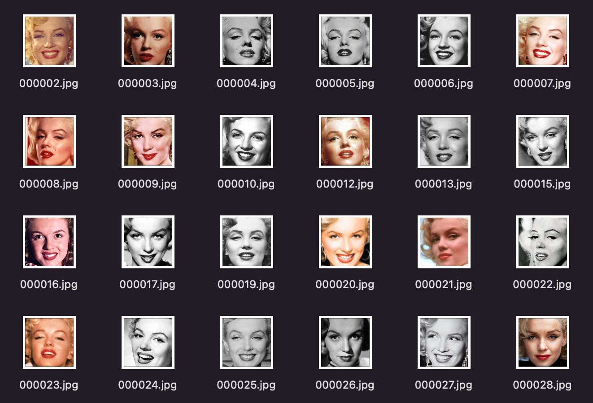

# 😉FaceCrawler
Python script to crawl people's images and crop face areas

## Setup

```bash
# Clone Repository
git clone https://github.com/shtnkgm/FaceCrawler.git
cd FaceCrawler

# Set Up
make
```

## Usage

```bash
# Fetch 100 Images for keyword person_name1, person_name2 ...
python3 crawler.py 100 person_name1 person_name2 ...
```

### Usage Example

```bash
python3 crawler.py 100 "Marilyn Monroe"
```



## Requirements

 - Python3
